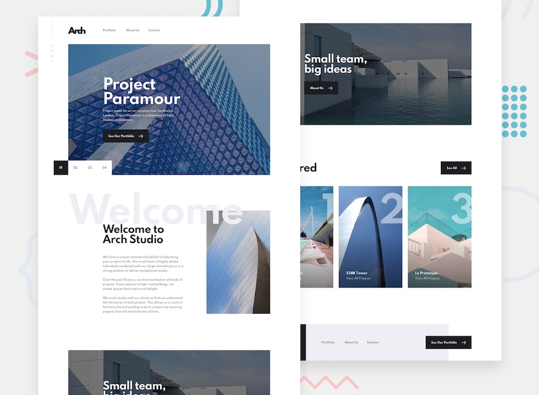

# Frontend Mentor - Arch Studio multi-page website

## Welcome! 👋

Thanks for purchasing this premium Frontend Mentor coding challenge.

[Frontend Mentor](https://www.frontendmentor.io) challenges allow you to improve your skills in a real-life workflow. These premium challenges are perfect portfolio pieces, so please do feel free to use what you build in your portfolio to show others.

**To do this challenge, you need a solid understanding of HTML and CSS and a basic understanding of JavaScript.**

## The challenge

Your challenge is to build out this multi-page website and get it looking as close to the design as possible.

You can use any tools you like to help you complete the challenge. So if you've got something you'd like to practice, feel free to give it a go.

Your users should be able to: 

- View the optimal layout for each page depending on their device's screen size
- See hover states for all interactive elements throughout the site
- Receive an error message when the contact form is submitted if:
  - The `Name`, `Email` or `Message` fields are empty should show "Can't be empty"
  - The `Email` is not formatted correctly should show "Please use a valid email address"
- **Bonus**: View actual locations on the contact page map (you could use a mapping API like Google Maps or Mapbox for this). The addresses we have on the design are fictional, so you'll need to add real addresses for this bonus task.

**IMPORTANT**: If you choose to do the bonus part of the challenge and use a mapping API be sure to secure your API Key. Here are guides for both Google Maps and Mapbox, be sure to read through them thoroughly:

- [API Key best practices from Google Developers](https://developers.google.com/maps/api-key-best-practices)
- [How to use Mapbox securely](https://docs.mapbox.com/help/troubleshooting/how-to-use-mapbox-securely/)

Exposing your API Key publicly can lead to other people using it to make requests for their own application. Please be sure you read the guides thoroughly and follow their recommendations. We don't take any responsibility if you accidentally expose your API Key while completing the challenge.

### Expected Behaviour

The following points are to clarify behaviour for areas where you might not be sure what's expected.

#### Home

- When one of the 3 Featured projects near the bottom are clicked, navigate to the `/portfolio` page.

#### Portfolio

- The thumbnails on the `/portfolio` index page should be anchor tags but should not link anywhere. If this were a real site, these could link to the project websites individually.

#### Contact

- Clicking on "View on Map" should scroll down to the map if you're using the static images
- If you're using Google Maps, clicking on "View on Map" should highlight the office that the link was clicked for

Want some support on the challenge? [Join our Slack community](https://www.frontendmentor.io/slack) and ask questions in the **#help** channel.

## Where to find everything

Your task is to build out the project to the Sketch design file provided. You can download the design file on the platform. It comes with a `README.md` file as well to help you get set up on Sketch or other popular design tools like Figma and Adobe XD.

You will also find mobile, tablet, desktop, and active state designs in JPG format if you wish to use them.

All the required assets for this project are in the `/assets` folder. The assets are already exported for the correct screen size and optimized. For some images, we have provided desktop, tablet, and mobile versions. This will allow you to optimize which image you display based on the user's device size. If you don't see a tablet or mobile version for an image, it's because the desktop image is near enough the same dimensions or the image isn't displayed for those screen sizes.

The [design system](./design-system.jpg) will give you more information about the various colors, fonts, and styles used in this project.

## Building your project

Feel free to use any workflow that you feel comfortable with. Below is a suggested process, but do not feel like you need to follow these steps:

1. Separate the `starter-code` from the rest of this project and rename it to something meaningful for you. Initialize the codebase as a public repository on [GitHub](https://github.com/). This will make it easier to share your code with the community if you need some help. If you're not sure how to do this, [have a read through of this Try Git resource](https://try.github.io/). **IMPORTANT: There are already a couple of `.gitignore` files in this project. Please do not remove them or change the content of the files. This is to avoid the accidental upload of the design system or Sketch file to GitHub. With these premium challenges, please be sure not to share the design system or Sketch file in your GitHub repo. Thanks!**
2. Configure your repository to publish your code to a URL. This will also be useful if you need some help during a challenge as you can share the URL for your project with your repo URL. There are a number of ways to do this, but we recommend using [Vercel](https://bit.ly/fem-vercel). We've got more information about deploying your project with Vercel below.
3. Look through the designs to start planning out how you'll tackle the project. This step is crucial to help you think ahead for CSS classes that you could create to make reusable styles.
4. Before adding any styles, structure your content with HTML. Writing your HTML first can help focus your attention on creating well-structured content.
5. Write out the base styles for your project, including general content styles, such as `font-family` and `font-size`.
6. Start adding styles to the top of the page and work down. Only move on to the next section once you're happy you've completed the area you're working on.
7. If you'd like to try making your project fully responsive, we'd recommend checking out [Sizzy](https://bit.ly/fm-sizzy). It's a great browser that makes it easy to view your site across multiple devices.

## Deploying your project

As mentioned above, there are a number of ways to host your project for free. We recommend using [Vercel](https://bit.ly/fem-vercel) as it's an amazing service and extremely simple to get set up with. If you'd like to use Vercel, here are some steps to follow to get started:

1. [Sign up to Vercel](https://bit.ly/fem-vercel-signup) and go through the onboarding flow, ensuring your GitHub account is connected by using their [Vercel for GitHub](https://vercel.com/docs/v2/git-integrations/vercel-for-github) integration.
2. Connect your project to Vercel from the ["Import project" page](https://vercel.com/import), using the "From Git Repository" button and selecting the project you want to deploy.
3. Once connected, every time you `git push`, Vercel will create a new [deployment](https://vercel.com/docs/v2/platform/deployments) and the deployment URL will be shown on your [Dashboard](https://vercel.com/dashboard). You will also receive an email for each deployment with the URL.

## Sharing your solution

There are multiple places you can share your solution:

1. Submit it on the platform so that other users will see your solution on the site. Here's our ["Complete guide to submitting solutions"](https://medium.com/frontend-mentor/a-complete-guide-to-submitting-solutions-on-frontend-mentor-ac6384162248) to help you do that. **With these premium challenges please be sure not to upload the design system or Sketch file to GitHub when you're submitting to the platform and sharing it around.**
2. Share your solution page in the **#finished-projects** channel of the [Slack community](https://www.frontendmentor.io/slack).
3. Tweet [@frontendmentor](https://twitter.com/frontendmentor) and mention **@frontendmentor** including the repo and live URLs in the tweet. We'd love to take a look at what you've built and help share it around.

## Giving feedback

Feedback is always welcome, so if you have any to give on this challenge please email hi[at]frontendmentor[dot]io.

**Have fun building!** 🚀

## Community Sponsors

A massive thank you to our community sponsors!

- [Sizzy](https://bit.ly/fm-sizzy) is an extremely useful browser designed specifically to improve a developer's workflow when building websites. You can fire up multiple device emulators and run them all in sync while building out your web pages. Perfect for helping build fully responsive websites!
- [Diversify Tech](https://bit.ly/fem-diversify-tech) is an amazing resource for underrepresented people in tech. The site features job listings for anyone seeking new opportunities. The resource section is also full of useful links to dive into!
- [Dracula PRO](https://bit.ly/fem-dracula) is a beautiful dark theme to help keep you focused and productive while you code. The theme isn't just for your editor either. You can also apply it to your most-used apps like your terminal and even Slack!